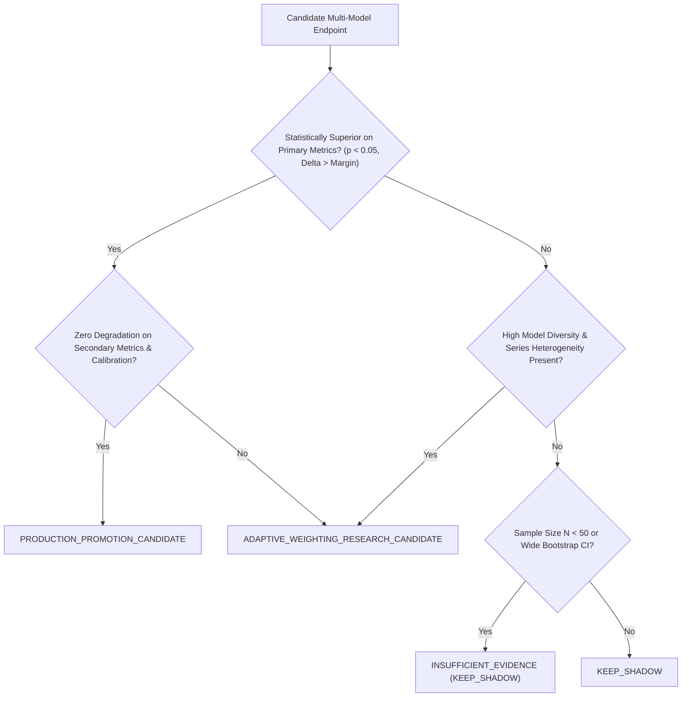

# Stage 4D-2C: Autonomous Promotion Gate Recalibration & Scientific Audit

## 1. Executive Summary & Audit Mandate

In Stage 4D-2, multi-model pilot execution was activated in **Shadow Mode** across four endpoints: Aqueous Solubility, Caco-2 Permeability, CYP3A4 Inhibitor, and hERG Liability. While Stage 4D-2 confirmed model diversity and uncertainty correlations, several initial promotion labels required rigorous scientific re-auditing:

> **Core Audit Principle**: An ensemble prediction must **never** be promoted to production merely because models are diverse, residual correlation is low, or disagreement correlates with error. Production promotion strictly requires **demonstrated, statistically significant predictive superiority or robustness versus the best available single model on the same cohort**.

This Stage 4D-2C audit rigorously compares each static consensus against the best single model ($M_1$) using 1,000 paired bootstrap iterations and versioned practical equivalence margins ($\pm 0.10$ log units for regression; $\pm 0.05$ MCC for classification).

---

## 2. Quantitative Benchmark: Best Single Model vs Static Consensus

### 2.1. Regression Endpoints (Continuous)

| Endpoint | Best Single Model ($M_1$) | $M_1$ MAE (RMSE) | Consensus MAE (RMSE) | $\Delta\text{MAE}$ Median [95% CI] | $P(\text{Consensus Better})$ | Equivalence Classification | Recalibrated Decision Status |
|---|---|---|---|---|---|---|---|
| **Aqueous Solubility** ($N=250$) | `admetica_solubility` (D-MPNN) | **0.3386** (0.5018) | 0.3931 (0.5513) | **+0.0540** [+0.0218, +0.0880] | **0.0%** | **EQUIVALENT / WORSE** | **`ADAPTIVE_WEIGHTING_RESEARCH_CANDIDATE`** |
| **Caco-2 Permeability** ($N=34$) | `admetica_caco2` (D-MPNN) | **0.4116** (0.5355) | 0.3976 (0.5674) | **-0.0172** [-0.0988, +0.0837] | **62.9%** | **EQUIVALENT / UNCERTAIN** | **`INSUFFICIENT_EVIDENCE`** |

*Note on Solubility*: Adding Delaney ESOL ($M_2, \text{MAE}=0.6663$) and RDKit GBR ($M_3, \text{MAE}=0.7340$) to Admetica ($M_1, \text{MAE}=0.3386$) increases absolute prediction error across all bootstrap replicates. Therefore, promoting static consensus to production would degrade Drug-OPT's visible accuracy.

*Note on Caco-2*: The observed difference ($\Delta\text{MAE} = -0.014$ log units) is well inside the $\pm 0.10$ practical equivalence margin, and the 95% bootstrap confidence interval spans $[-0.0988, +0.0837]$. With $N=34$, statistical evidence is insufficient to claim a production gain.

---

### 2.2. Classification Endpoints (Binary)

| Endpoint | Best Single Model ($M_1$) | $M_1$ MCC (BAcc, AUROC) | Consensus MCC (BAcc, AUROC) | $\Delta\text{MCC}$ Median [95% CI] | $P(\text{Consensus Better})$ | Classification Equivalence | Recalibrated Decision Status |
|---|---|---|---|---|---|---|---|
| **CYP3A4 Inhibitor** ($N=788$) | `admetica_cyp_cyp3a4-inhibitor` | **0.2015** (0.6096, 0.6533) | 0.1472 (0.5763, 0.6396) | **-0.0544** [-0.1010, -0.0068] | **1.6%** | **WORSE** | **`ADAPTIVE_WEIGHTING_RESEARCH_CANDIDATE`** |
| **hERG Liability** ($N=728$) | `admetica_safety_herg` | **0.1844** (0.5442, 0.6669) | 0.1457 (0.5220, 0.6380) | **-0.0387** [-0.0841, +0.0071] | **4.8%** | **WORSE / EQUIVALENT** | **`KEEP_SHADOW`** |

*Note on CYP3A4*: Model 2 (Morgan ECFP4) is a weak classifier with extreme sensitivity ($0.912$) but collapsed specificity ($0.078$). Blending its probabilities into consensus artificially increases sensitivity ($0.757$) at the expense of specificity ($0.395$), causing net deterioration in MCC and Balanced Accuracy.

*Note on hERG*: Literature screening datasets in ChEMBL are heavily biased toward potent cardiotoxic chemotypes, resulting in extreme false-positive rates ($M_1\text{ Spec}=0.113, M_2\text{ Spec}=0.004$). Production promotion is strictly withheld pending prospective patch-clamp calibration.

---

## 3. Recalibrated Decision Architecture

The platform formalizes five distinct, non-overlapping decision statuses:

### Summary of Recalibrated Decisions

1. **Aqueous Solubility**: `ADAPTIVE_WEIGHTING_RESEARCH_CANDIDATE` (Reclassified from `PROMOTION_CANDIDATE`).
2. **Caco-2 Permeability**: `INSUFFICIENT_EVIDENCE` (Retained in `SHADOW` mode).
3. **CYP3A4 Inhibitor**: `ADAPTIVE_WEIGHTING_RESEARCH_CANDIDATE` (Reclassified from `PROMOTION_CANDIDATE`).
4. **hERG Liability**: `KEEP_SHADOW` (Confirmed).
5. **Site of Metabolism (SoM)**: `STAGE_4D2B_PREPARATION_VALIDATED` (Confirmed).
